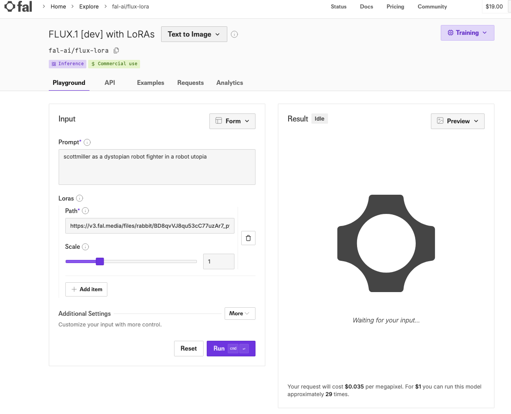

# Generate Realistic Headshots using Flux using the Fal UI

These instructions use the [fal.ai](https://fal.ai/) with the Flux. [Flux](https://blackforestlabs.ai/ultra-home/#get-flux) is a AI text to image generation model from BlackForestLabs. 

There are two parts.  
   - Part1 uses a the [flux-pro/v1.1-ultra](https://fal.ai/models/fal-ai/flux-pro/v1.1-ultra) api to generate a image directly from the prompt
   - Part2 uses the [flux-lora-fast-training](https://fal.ai/models/fal-ai/flux-lora-fast-training) to create a lora for the [flux-lora(Flux.1[dev])](https://fal.ai/models/fal-ai/flux-lora?from_training=c9c29034-83c2-4654-b455-e35a7ccc1ead)

## Prerequisites:
- Sign up on [Fal.ai]((https://fal.ai/) ) using your GitHub account. You will need to buy credit. I purchased $20 in credit.
- Follow the instructions to setup the [Fal api client for python](https://fal.ai/models/fal-ai/flux-pro/v1.1-ultra/api?platform=python)

## Use the flux-pro/v1.1-ultra to generate an image

1. 

## Setup

1. Take photos of 15-20 selfie in various angles 

2. Put them in a folder
   
3. Rename the photos so they have your name in them.  For example, photo_of_scottmiller_XXXX.jpg

4. Zip the photos

5. Add the images to the [fal-ai/flux-lora-fast-training model](https://fal.ai/models/fal-ai/flux-lora-fast-training)

6. Set the Trigger word as your name scottmiller
7. Start the training 
8. Once the training is done click 'run inference'
 
9. Specify the prompt that includes the keyword of your name
   

## Prompt Examples

- `scottmiller as a Battle Angel in a utopia
full body shot will zoom out close up`
- `scottmiller as a battle warrior in a utopia full body shot`

## Reference

This [Youtube video form Julia McCoy](https://www.youtube.com/watch?v=lcNb-0XspwU&t=360s) is the basis this work.

